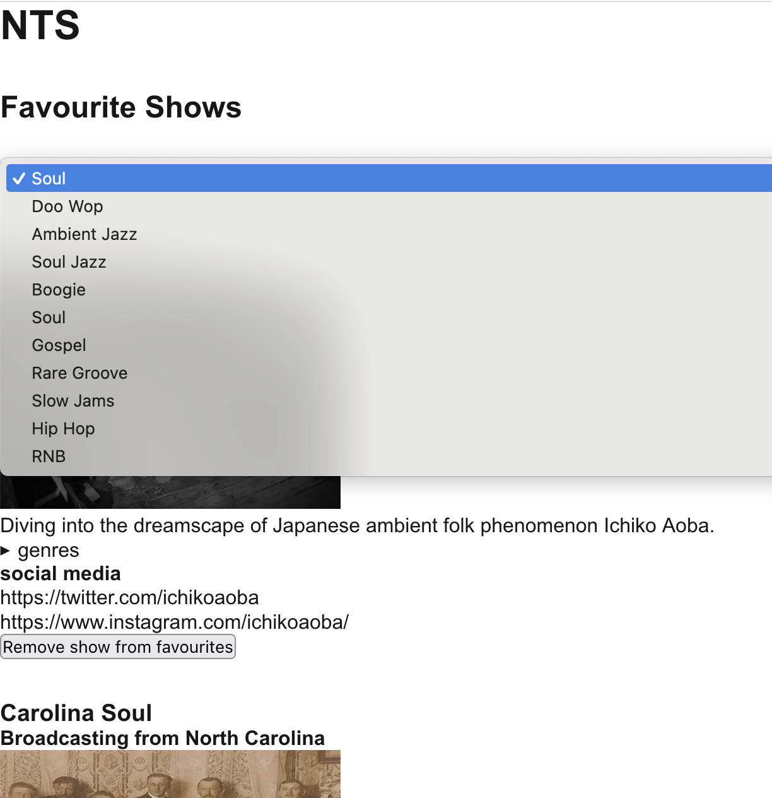

## Karin's Demo App

This repository aims to compile some cool things together into a project. The app directory contains the app code, which is built into a docker image and deployed in the infra directory.

## Stack

- Nextjs
- Pulumi
- Kubernetes
- MongoDB
- OpenTelemetry
- Jaeger

## Local Development

To begin, ensure you have the following installed:

- [Yarn](https://classic.yarnpkg.com/lang/en/docs/install/#mac-stable)
- [Pulumi](https://www.pulumi.com/docs/iac/download-install/)
- [Docker Desktop](https://www.docker.com/products/docker-desktop/)
- [Kubectl](https://kubernetes.io/docs/tasks/tools/install-kubectl-macos/)

First, navigate to the `infra` directory. Ensure a directory called "state" is located in the root.

Run `yarn` to install all dependencies. Ensure docker desktop is running and has Kubernetes enabled.

Then run the following:

`pulumi:local` - This will log you into a local pulumi state .

`pulumi:deploy` - This will deploy the app. Follow the prompts and name the app "app".

Next, you need to port-forward the various services using `yarn forward` so we can access the app and the database, and telemetry can flow from the app through to the collector into jaeger.

Jaeger will be accessible at: `localhost:16686`
The app will be accessible at `localhost:3000`

